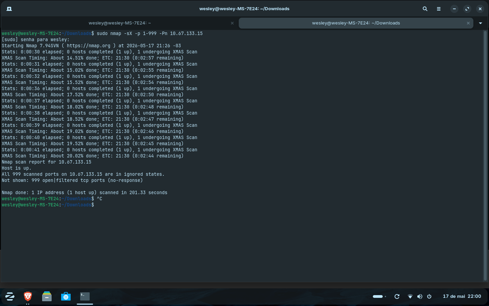
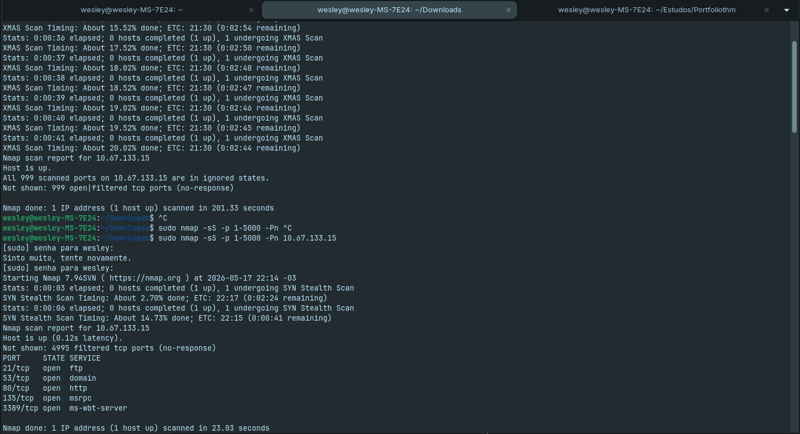
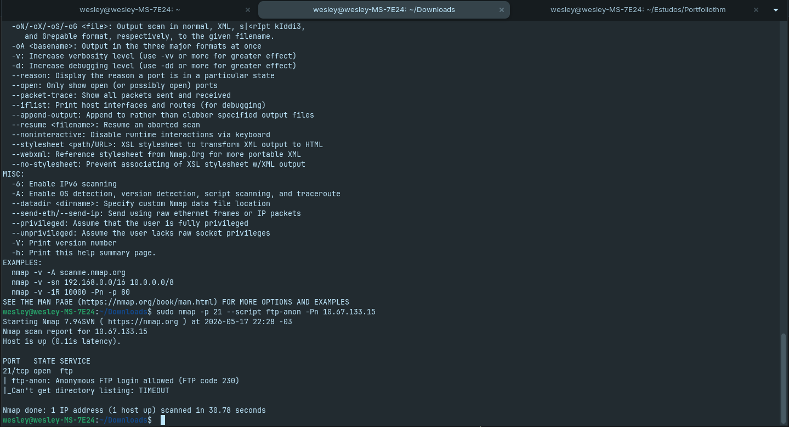
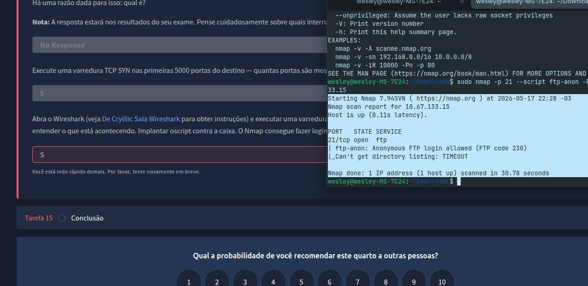

# Reconhecimento de Rede e Evasão de Firewall com Nmap (TryHackMe)

## 📌 Sobre o Projeto
Este repositório documenta a conclusão do laboratório prático de técnicas avançadas de varredura com o Nmap na plataforma TryHackMe. O objetivo foi analisar o comportamento de portas de um host ativo protegido por firewall, aplicando varreduras furtivas (Stealth) e análise de scripts NSE (Nmap Scripting Engine).

---

## 🛠️ Ambiente Prático
* **Sistema Operacional Atacante:** Zorin OS (Linux)
* **Conectividade:** OpenVPN (Túnel dedicado à rede privada do TryHackMe)
* **Ferramentas Utilizadas:** Nmap, Ping (ICMP)

---

## 📑 O que eu aprendi

### 1. Descoberta de Host (ICMP vs Firewall)
Durante os testes iniciais, o comando clássico de monitoramento de integridade de rede (`ping`) não obteve resposta do host alvo.
* **Diagnóstico**: O firewall da infraestrutura estava configurado para descartar (drop) pacotes ICMP Echo Request.
* **Solução**: Foi necessário aplicar o argumento `-Pn` em todas as varreduras subsequentes para desativar a descoberta de host por ping, forçando o Nmap a tratar o alvo como ativo e prosseguir diretamente para o escaneamento de portas.

### 2. Entendendo a Sintaxe dos Comandos Utilizados:
* `sudo`: Scans do tipo Xmas (`-sX`) manipulam bits específicos do cabeçalho TCP (FIN, PSH e URG). No Linux, apenas o usuário root (ou usando sudo) tem permissão para criar esses pacotes brutos personalizados.
* `-p 1-999`: Define o intervalo de alvos. O exercício pede especificamente as primeiras 999 portas. Se omitido, o Nmap escaneia as 1000 portas mais comuns por padrão.
* `-Pn`: Trata o host como ativo. Como a máquina não responde ao ping, se não usarmos o `-Pn`, o Nmap assume que o host está desligado e encerra a varredura sem testar as portas.
* `IP`: O endereço de destino do alvo na rede privada do TryHackMe.

---

## 🚀 Execução dos Laboratórios Práticos

### A. Varredura Xmas (Natal)
O scanner reportou as portas em estado ambíguo devido à falta de retorno de pacotes.
* **Comando utilizado**: `sudo nmap -sX -p 1-999 -Pn 10.67.133.15`

### B. Varredura TCP SYN e Auditoria de Serviços
Varredura do tipo Stealth para mapeamento de portas e identificação de serviços ativos.
* **Comando utilizado**: `sudo nmap -sS -p 1-5000 -Pn 10.67.133.15`
* **Resultado**: Foram identificadas 5 portas abertas no sistema alvo.

### C. Autenticação Anônima via NSE Script
Mapeamento focado na porta 21 utilizando o motor de scripts do Nmap para auditoria de segurança.
* **Comando utilizado**: `sudo nmap -p 21 --script ftp-anon -Pn 10.67.133.15`

* **Como o script `--script ftp-anon` funciona por dentro**:
  1. Conecta-se ao servidor FTP na porta padrão informada (porta 21).
  2. Tenta autenticar-se automaticamente usando o usuário `anonymous` (ou `ftp`) com uma senha padrão de teste.
  3. Se o acesso for permitido (retornando o código de sucesso 230), ele valida a falha, lista os arquivos do diretório raiz e destaca possíveis permissões perigosas de gravação (writeable).

---

## 🏆 Conclusão
Com a correta interpretação dos pacotes e o uso estratégico das flags do Nmap para contornar as restrições do firewall, todas as etapas de reconhecimento foram validadas e concluídas com sucesso. O laboratório provou a importância de conhecer a fundo os protocolos de rede para identificar vulnerabilidades reais de configuração (como o acesso FTP exposto).

---

## 👨‍💻 Sobre o Autor

* **Nome:** Wesley
* **Perfil:** Profissional técnico e soldador com mentalidade voltada à resolução de problemas e precisão. 
* **Atuação em Segurança Cibernética:** Estudante autodidata focado em Segurança da Informação, Redes e Testes de Penetração (Pentesting) durante o tempo livre.
* **Objetivo:** Registrar laboratórios práticos e evoluções teóricas para construir uma base sólida em análise de vulnerabilidades, auditorias de infraestrutura e segurança
 defensiva.

--- 
